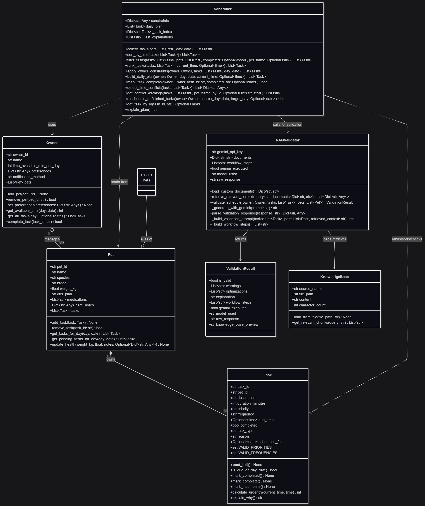
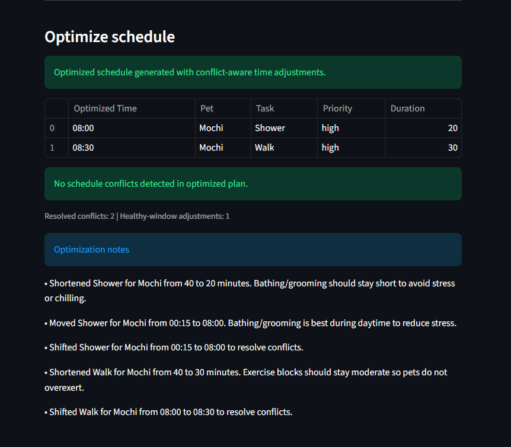
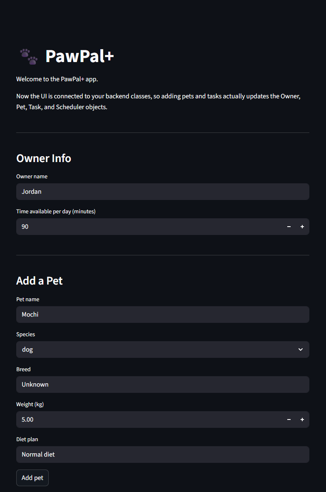
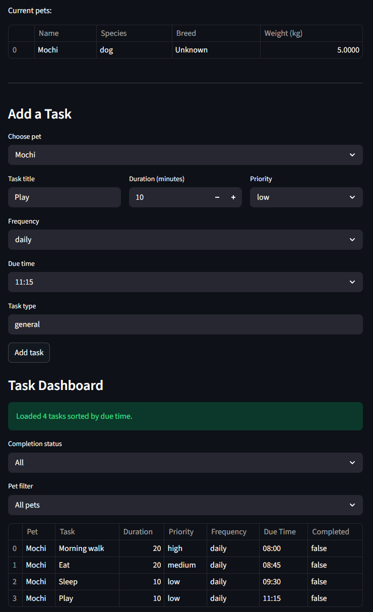
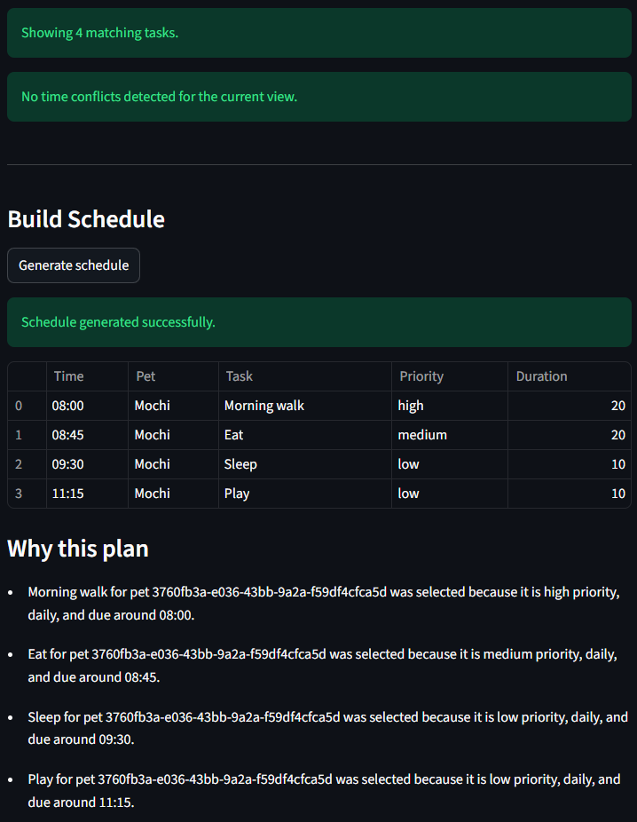

# PawPal+

PawPal+ is an intelligent pet-care planner that helps owners organize daily tasks across one or more pets using AI-powered insights and science-based recommendations.

## Table of Contents

- Overview
- What's New 
- Features
- Project Structure
- Architecture
- Installation
- Setting Up Your Gemini API Key
- Running the App
- How to Use
- RAG System (Retrieval-Augmented Generation)
- Scheduling Rules
- Extra Credit Features
- Testing
- Demo
- Troubleshooting

## 🆕 What's New

The original PawPal+ scheduler sorted tasks and detected conflicts, but it lacked intelligent validation and reasoning. The enhanced version adds:

- **RAG-Powered Validation**: Retrieves relevant pet-care science from multiple knowledge sources and uses Gemini AI to validate schedules against best practices.
- **Observable Workflow**: See exactly how the AI makes decisions — view retrieved evidence, workflow steps, and raw model responses.
- **Specialized Prompting**: The AI is trained via few-shot examples to behave like a pet-care expert, not a generic chatbot.
- **Optimize Schedule (NEW)**: Automatically retimes tasks and shortens overly long activities to reduce conflicts, avoid unhealthy windows (such as midnight bathing), and keep all pets in a fair, conflict-aware sequence.
- **Evaluation Metrics**: Benchmark script demonstrates measurable improvement over baseline heuristics.

## Overview

PawPal+ is designed for owners who need a clear daily plan for recurring and one-time pet-care tasks.
The app lets you:

- Add and manage pets with species, breed, weight, diet, and medication info.
- Add care tasks with duration, priority, frequency, and due time.
- Build a daily schedule sorted chronologically and ranked by urgency.
- Detect overlapping task times and surface warnings.
- **Validate your schedule against pet health best practices using AI (NEW FEATURE).**
- **Explain why tasks were selected and flagged, with cited evidence (NEW FEATURE).**

## Features

### Core Scheduling
- Pet and task profiles, including species, breed, weight, diet plan, priority (`low`, `medium`, `high`), frequency (`once`, `daily`, `weekly`), optional due time, and completion state.
- Scheduler capabilities:
  - Urgency-based ranking
  - Chronological sorting
  - Optional filtering by completion status and pet name
  - Owner-constraint application (time and preferences)
  - Recurring task generation on completion
  - Time conflict detection and warning messages

### Health & Safety Validation (NEW FEATURES)
- Retrieves relevant guidance from multiple pet-care knowledge sources.
- Uses Gemini AI to validate schedules against:
  - Medication timing and priorities
  - Feeding consistency and pet-species requirements
  - Hydration and exercise guidelines
  - Multi-pet coordination best practices
- Displays warnings with justifications and optimization suggestions.
- Shows observable workflow steps so you understand the AI's reasoning.

### Streamlit Dashboard
- Interactive UI with tables, filters, and real-time validation.
- Task dashboard sorted by due time.
- Conflict warnings with pet names (not IDs).
- "Why this plan" explanations.

### Optimize Schedule Engine (NEW FEATURES)
- Adds a bottom section called **Optimize schedule** after the default plan.
- Re-times tasks to avoid overlap instead of dropping one conflicting task.
- Shortens overly long activity blocks when they exceed healthy task-specific limits.
- Moves tasks into healthier windows by task type (example: shower/bath from midnight to daytime).
- Works across multiple pets and preserves priority-aware ordering.
- Shows optimization notes explaining each time adjustment.

## Project Structure

```
.
├── app.py                          # Streamlit UI and user workflow
├── pawpal_system.py                # Core domain and scheduling logic
├── rag_validator.py                # RAG retrieval and Gemini integration (NEW)
├── evaluate_rag.py                 # Benchmark harness for extra credit (NEW)
├── knowledge_base.txt              # Primary pet care knowledge base
├── rag_sources/
│   └── pet_science_notes.txt       # Supplemental science guidance (NEW)
├── tests/
│   ├── test_pawpal.py              # Unit tests for core behaviors
│   └── conftest.py                 # Pytest bootstrap (NEW)
├── requirements.txt                # Runtime and test dependencies
├── .env                            # API key (not committed to Git)
├── .gitignore                      # Exclude .env and __pycache__
├── Pet Care Task Management.png    # System architecture diagram
├── pawpal_structure.png            # New Mermaid structure diagram
├── pic1.png, pic2.png, pic3.png    # Demo images (original app)
└── README.md                       # This file
```

## Architecture

The system follows a layered architecture for managing pet-care tasks:


### Enhanced Mermaid Structure (New Features)



**Core Layers:**
- **Domain Layer** (pawpal_system.py): Pet, Owner, Task, and Scheduler classes with business logic.
- **Validation Layer** (rag_validator.py): RAG retrieval and Gemini integration for health & safety checks.
- **Presentation Layer** (app.py): Streamlit dashboard for user interaction.
- **Evaluation Layer** (evaluate_rag.py): Benchmark and metrics reporting.

## Installation

### Step 1: Create a Virtual Environment

Windows (PowerShell):
```powershell
python -m venv .venv
.venv\Scripts\Activate.ps1
```

macOS/Linux:
```bash
python -m venv .venv
source .venv/bin/activate
```

### Step 2: Install Dependencies

```bash
pip install -r requirements.txt
```

Key packages:
- **streamlit** (1.30+): Interactive web UI
- **google-genai** (1.0+): Gemini API client for validation
- **python-dotenv** (1.0+): Environment variable management
- **pytest** (7.0+): Test framework

## Setting Up Your Gemini API Key

### Option 1: Get a Free API Key (Recommended)

1. Go to [Google AI Studio](https://aistudio.google.com/prompts/new_chat).
2. Click **"Get API Key"** (top left).
3. Click **"Create API Key in new project"**.
4. Copy the generated API key.
5. Create a `.env` file in the project root directory:
   ```
   GOOGLE_API_KEY=your_api_key_here
   ```
6. Paste your key in place of `your_api_key_here`.
7. Save the file.

### Option 2: Use Existing Google Cloud Project

If you have a Google Cloud project:
1. Enable the Generative Language API.
2. Create an API key in the Credentials section.
3. Add it to `.env` as above.

### Verify Your Setup

After saving `.env`, run:
```bash
python -m streamlit run app.py
```

Click "Generate schedule" and open the "RAG Debug" expander. You should see:
- "Gemini call executed: True"
- "Knowledge base characters loaded: [number]"
- "Model used: gemini-2.5-flash" (or similar)

If it shows "False" or an error, check that your `.env` file is in the project root and contains a valid key.

## Running the App

```bash
python -m streamlit run app.py
```

After launch, open the local URL shown in the terminal.

## How to Use

### 1. Set Owner Info
- Enter your name and available minutes per day.

### 2. Add Pets
- Enter pet name, species (dog/cat/other), breed, weight, and diet plan.
- Click "Add pet" to save.

### 3. Add Tasks
- Select a pet from the dropdown.
- Enter task title, duration (minutes), priority (low/medium/high), frequency (once/daily/weekly), due time, and task type.
- Click "Add task" to save.

### 4. Review Task Dashboard
- View all tasks sorted by due time.
- Filter by completion status (Pending/Completed) and pet name.
- Warnings appear if tasks overlap at the same time.

### 5. Generate Schedule
- Click "Generate schedule" to build your daily plan.
- The schedule is sorted chronologically and ranked by urgency.

### 6. View Health & Safety Validation (NEW FEATURES)
- After generating a schedule, the app automatically validates it using AI.
- **Warnings**: Displays if the schedule conflicts with pet-care best practices (with explanations).
- **Optimizations**: AI - suggested improvements for scheduling or task priorities.
- **Agentic Workflow**: Expand to see the AI's reasoning steps.
- **RAG Debug**: Expand to see which knowledge sources were retrieved and used.

### 7. Understand Your Schedule
- "Why this plan" section lists reasons each task was selected.

### 8. Optimize Schedule 
- Scroll to the **Optimize schedule** section at the bottom after generating a plan.
- Review the adjusted schedule table and optimization notes.
- Use it when the health validator flags risky timing (for example, late-night showering) or when pets have same-time conflicts.



## RAG System (Retrieval-Augmented Generation)

### What is RAG?

RAG combines **retrieval** (finding relevant information) with **generation** (creating new text). In PawPal+:

1. **Retrieval**: When validating a schedule, the system searches a knowledge base for pet-care guidance relevant to the tasks, pet species, and time conflicts.
2. **Generation**: It sends the retrieved facts to Gemini, which synthesizes them into specific warnings and optimizations.

### Why Multiple Sources?

The system retrieves from two knowledge sources:

- **knowledge_base.txt**: General pet care guidelines (feeding, medication, hydration, multi-pet management, behavioral monitoring).
- **rag_sources/pet_science_notes.txt**: Supplemental science-based guidance (dog-specific energy levels, cat-specific meal patterns, multi-pet coordination).

Multiple sources ensure the AI considers both broad principles and specialized knowledge.

### How to See It In Action

1. Run the app: `python -m streamlit run app.py`
2. Add a pet and a few tasks.
3. Click "Generate schedule".
4. In the "🔍 Health & Safety Validation" section, expand **"RAG Debug (How to verify it is running)"**.
5. You'll see:
   - **Knowledge base characters loaded**: How many bytes were available for retrieval.
   - **Gemini call executed**: True/False (whether the AI was invoked).
   - **Model used**: Which Gemini model processed the request.
   - **Raw Gemini response**: The AI's full reasoning before parsing.
   - **Knowledge base preview**: The actual text sent to the AI for retrieval.

## Scheduling Rules

- **Sorting**: Tasks are displayed in chronological order by due time. Tasks without a due time are shown last.
- **Ranking**: Higher urgency tasks are prioritized based on priority level, due-time pressure, and completion status.
- **Constraints**: The scheduler respects available daily minutes and optional owner preferences.
- **Recurrence**:
  - Completing a `daily` task creates a new task for the next day.
  - Completing a `weekly` task creates a new task for the same weekday in the following week.
- **Conflict Detection**: Tasks sharing the same due time are grouped and returned as warning messages.

## Extra Credit Features

### 1. RAG Enhancement
- Multi-source document retrieval with relevance ranking.
- Fallback mechanisms for missing or incomplete knowledge bases.

### 2. Agentic Workflow
- Observable intermediate steps:
  1. **Load documents**: Reads primary and supplemental sources.
  2. **Retrieve evidence**: Identifies relevant chunks using BM25-like scoring.
  3. **Generate analysis**: Sends context to Gemini for synthesis.
  4. **Parse result**: Structures output into warnings and optimizations.
- Visible in the app's "Agentic Workflow" expander.

### 3. Fine-Tuning / Specialization
- Few-shot prompting with examples of good and bad schedules.
- Strict output format instructions to ensure consistent parsing.
- Specialized tone: behaves like a veterinary-informed scheduler, not generic chat.

### 4. Evaluation Script
- **File**: `evaluate_rag.py`
- **Purpose**: Benchmark baseline heuristics vs. enhanced RAG-powered validation.
- **Usage**:
  ```bash
  python evaluate_rag.py
  ```
- **Output**: Per-test-case baseline/enhanced scores, improvement deltas, retrieved sources, workflow step counts.

### 5. Conflict-Aware Optimizer
- **File**: `pawpal_system.py` (`Scheduler.optimize_schedule`)
- **Purpose**: Generate a second, improved schedule that resolves overlaps and unhealthy timing windows.
- **Behavior**:
  - Re-times conflicting tasks in slot increments.
  - Keeps all due tasks in the optimized output when possible.
  - Produces human-readable notes that justify each adjustment.

## Testing

Run all tests:
```bash
python -m pytest -q
```

Expected output:
```
................  [100%]
16 passed in X.XXs
```

The test suite covers:
- Task addition and completion behavior.
- Sorting correctness and daily-plan order.
- Filtering by completion and pet name.
- Recurrence logic for daily and weekly tasks.
- Time conflict detection and warning generation.
- **RAG retrieval ranking and document loading (NEW).**
- **Optimized schedule behavior for midnight safety and multi-pet conflicts (NEW).**

## Demo

### Original App (Before Enhancements)




### Enhanced App (With RAG Validation)
*New demo images coming soon to show:*
- *Health & Safety Validation panel with AI warnings*
- *Agentic Workflow steps visualization*
- *RAG Debug panel with retrieved sources*

## Troubleshooting

### Streamlit command not found
- Ensure your virtual environment is activated.
- Reinstall dependencies: `pip install -r requirements.txt`

### No tasks shown in schedule
- Confirm at least one pet and task exist.
- Confirm owner available minutes are sufficient for selected tasks.

### Validation returns a warning but no reason
- Expand "RAG Debug" to see the raw Gemini response.
- Check that your `.env` file contains a valid `GOOGLE_API_KEY`.
- If the API key is invalid, get a new one from [Google AI Studio](https://aistudio.google.com/prompts/new_chat).

### Tests fail with import errors
- Ensure you're running pytest from the project root: `pytest -q`
- If still failing, restart your virtual environment.

### FutureWarning about deprecated packages
- These are typically benign. The project uses the latest `google-genai` package.
- To suppress: `python -W ignore::FutureWarning -m pytest -q`

### API rate limits
- The free Gemini API has usage limits. If you hit them, wait a few hours or upgrade your quota in Google Cloud Console.

